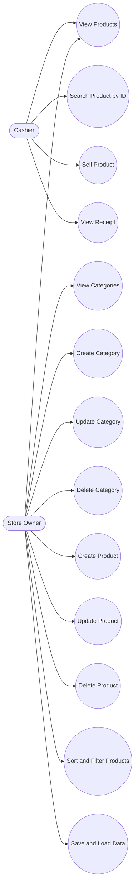
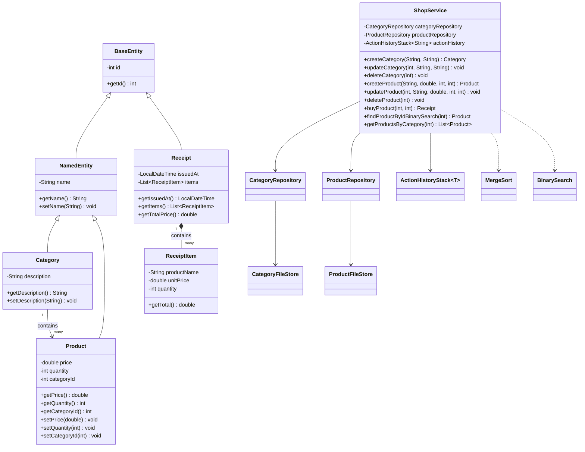

# Pet Shop Inventory Manager

## Project Description
`Pet Shop Inventory Manager` is a JavaFX desktop application for managing a pet shop inventory. The application works with two related domain entities: categories and products. One category can contain many products, and each product belongs to one category.

The application supports:
- CRUD for categories;
- CRUD for products;
- product purchase with automatic stock reduction and receipt generation;
- data persistence between sessions in a custom text format;
- product sorting with the merge sort algorithm;
- binary search by product `ID`;
- action history display stored in a custom `Stack` data structure.

## Main Features
- Add, edit, and delete categories.
- Add, edit, and delete products.
- View products linked to the selected category in the categories tab.
- Filter products by name and category.
- Sort products by `ID`, name, price, and quantity.
- Search for a product by identifier using binary search.
- Sell a product with stock validation.
- View the latest user actions.

## OOP Principles Used
- Encapsulation: domain class fields are hidden and accessed through methods.
- Inheritance: `Category` and `Product` inherit from `NamedEntity`, and `NamedEntity` inherits from `BaseEntity`.
- Aggregation/composition: `Receipt` contains a list of `ReceiptItem`, and `ShopService` aggregates repositories and action history.
- Decomposition: the project is split into packages `model`, `repository`, `persistence`, `service`, `algorithm`, and `ui`.

## File Storage
Data is stored in the `data/` folder, which is created automatically on the first launch:
- `data/categories.db`
- `data/products.db`

The project uses a custom text format:
- fields in a record are separated by `|`
- special characters are escaped with `\`
- line breaks are stored as `\n`

Record examples:

```text
1|Cats|Dry and wet food for cats
2|Dog Wet Food Chicken|95.0|25|2
```

## UML Use Case Diagram


## UML Class Diagram


## Criteria Coverage
- Two related entities: `Category` and `Product` with a one-to-many relationship.
- Full CRUD: implemented for both entities in the UI and service layer.
- File I/O: reading and writing are implemented through `CategoryFileStore` and `ProductFileStore`.
- Custom data structure: `ActionHistoryStack<T>`.
- Sort: custom `MergeSort` implementation.
- Search: custom `BinarySearch` implementation.
