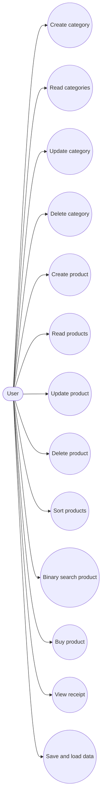
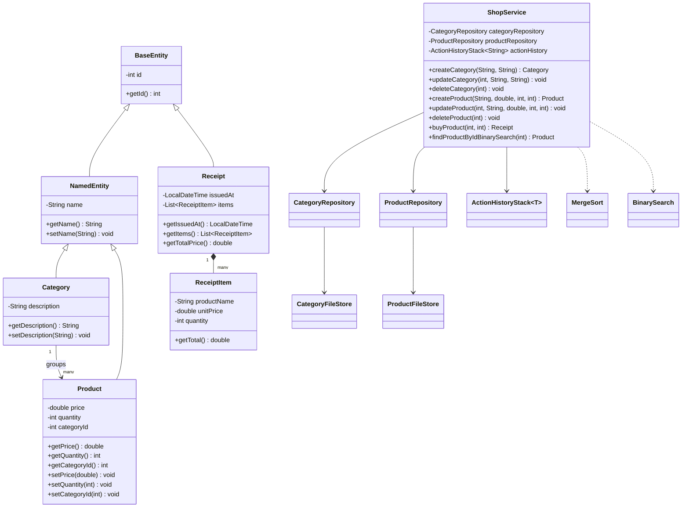

# Pet Shop Inventory Manager

## Описание проекта
`Pet Shop Inventory Manager` — настольное JavaFX-приложение для учёта ассортимента зоомагазина. Приложение позволяет работать с двумя связанными сущностями: категориями товаров и товарами. Одна категория может содержать много товаров, а каждый товар принадлежит одной категории.

Приложение поддерживает:
- CRUD для категорий;
- CRUD для товаров;
- покупку товара с автоматическим уменьшением остатка и генерацией чека;
- сохранение данных между сессиями в собственном текстовом формате;
- сортировку товаров алгоритмом merge sort;
- бинарный поиск товара по `ID`;
- отображение истории действий, которая хранится в собственной структуре данных `Stack`.

## Основные функции
- Добавление, редактирование и удаление категорий.
- Добавление, редактирование и удаление товаров.
- Фильтрация товаров по имени и категории.
- Сортировка товаров по `ID`, названию, цене и количеству.
- Бинарный поиск товара по идентификатору.
- Продажа товара с проверкой остатка.
- Просмотр последних действий пользователя.

## Использованные принципы ООП
- Инкапсуляция: поля доменных классов скрыты и доступны через методы.
- Наследование: `Category` и `Product` наследуются от `NamedEntity`, а `NamedEntity` наследуется от `BaseEntity`.
- Агрегация/композиция: `Receipt` содержит список `ReceiptItem`, `ShopService` агрегирует репозитории и историю действий.
- Декомпозиция: проект разделён на пакеты `model`, `repository`, `persistence`, `service`, `algorithm`, `ui`.

## Хранение данных в файлах
Данные сохраняются в папке `data/`, которая создаётся автоматически при первом запуске:
- `data/categories.db`
- `data/products.db`

Используется собственный текстовый формат:
- поля в записи разделяются символом `|`
- специальные символы экранируются через `\`
- перенос строки хранится как `\n`

Примеры записей:

```text
1|Cats|Dry and wet food for cats
2|Dog Wet Food Chicken|95.0|25|2
```

## UML Use Case Diagram


## UML Class Diagram


## Как критерии закрываются в проекте
- Две связанные сущности: `Category` и `Product` c отношением one-to-many.
- Полный CRUD: реализован для обеих сущностей в интерфейсе и сервисном слое.
- File I/O: чтение и запись выполняются студентом через `CategoryFileStore` и `ProductFileStore`.
- Custom data structure: `ActionHistoryStack<T>`.
- Sort: собственная реализация `MergeSort`.
- Search: собственная реализация `BinarySearch`.
